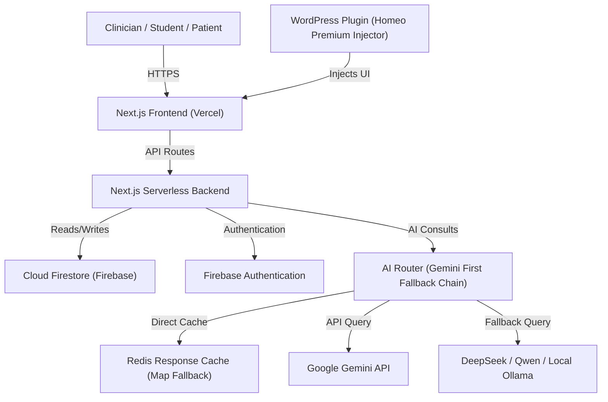

# Current System Architecture

This document presents a comprehensive, up-to-date view of the Unified Clinical OS and Knowledge Platform.

## 1. System Architecture Overview

## 2. Architecture Components

### Frontend Modules
The frontend is built on **Next.js 16.2.9** and structured under `/src/app` using React Server Components (RSC) and Client Components:
- `/src/app/admin`: Clinician and Editorial Dashboard (single-pane workspace).
- `/src/app/knowledge`: Public-facing search and explorer interfaces.
- `/src/app/patient`: Patient check-in and treatment planner review screens.
- `/src/app/health-intelligence`: Integrated metrics and assessment dashboards.
- `/src/components`: Generic global components (layout, buttons, modal, form elements).

### Backend Services
API endpoints are deployed as serverless functions under `/src/app/api`:
- `/api/consult-ai`: Receives queries and triggers `AIRouterService`.
- `/api/repertory`: Clinical scoring and saving sessions.
- `/api/public/search`: Fast index queries with synonyms.

### Database (Cloud Firestore)
Firestore serves as the primary persistence layer.
- Collections: `patients`, `sessions`, `knowledge` (articles, remedies, diseases, symptoms), `invoices`, `repertory_sessions`.
- Security: Governed by `firestore.rules` preventing unauthenticated data mutations.

### Authentication
Secured via **Firebase Authentication** tokens validated in backend middleware (`src/lib/firebaseAuthVerify.ts` & `src/lib/adminSession.ts`).

### AI Router & Caching
- **Routing**: `AIRouterService` at `src/lib/aiRouter.ts` implements a fallback query execution chain (Gemini $\rightarrow$ DeepSeek/Qwen $\rightarrow$ Local Ollama).
- **RAG Lookup**: Bypasses LLM calls for standard definitions using `ragService.ts` if match confidence $\ge 90\%$.
- **Cache**: Response caching at `cacheService.ts` targeting Redis (with in-memory fallback).

### WordPress Integration
- **Plugin**: `homeo-premium-injector` (under `/scratch/homeo-premium-injector/`) injects custom clinical scripts and overrides headers directly on client websites to embed the Next.js search portal.

---

## 3. Operations & Hosting Environment
*   **Deployment**: Hosted on **Vercel** with GitHub trigger pipelines automatically deploying the `main` branch.
*   **External APIs**:
    *   Google Generative AI (Gemini API)
    *   DeepSeek / OpenRouter API endpoints
    *   Google Sheets integration API (remedy sync)

---

## 4. Codebase Folder Conventions

- `src/features/[feature_name]/components/`: View components isolated by domain.
- `src/features/[feature_name]/__tests__/`: Unit tests for domain logic.
- `src/lib/`: Unified server and utility services.
