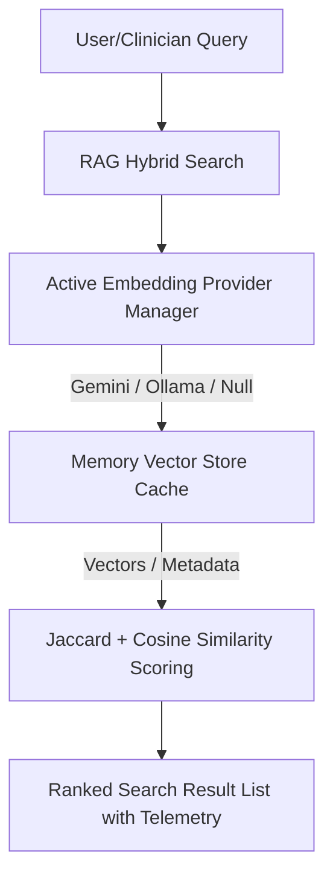

# AI Knowledge Layer & Retrieval Architecture

This document describes the design, safeguards, and optimization rules governing the AI Knowledge Layer, including semantic indexing, MemoryVectorStore caching, and RAG search boundary guards.

## System Architecture

The AI Knowledge Layer operates as an assistant-guided search and grounding pipeline supporting the Clinical OS and Internal Editorial Cockpit:

---

## V2.2.1 Performance Safety Rules

To prevent severe latency spikes and CPU lockups, the following production rules are strictly enforced:

### 1. Zero Live Document Generation during Search
- **Query Embeddings**: Generating an embedding for the **incoming user query** at search time is acceptable and expected.
- **Document Embeddings**: Generating or recalculating embeddings for documents inside the query search iteration loop is **prohibited**. All document vectors must be precalculated or manually synchronized via Admin Cockpit actions.

### 2. Graceful Caching & Missing Vector Fallback
- If a document is missing its precomputed vector in the `MemoryVectorStore` cache, the search pipeline must fall back to keyword and Jaccard text scoring for that document. 
- Search execution must remain non-blocking. A cache miss must never prevent search results from returning.

### 3. Resilient Dimension Mismatches
- In the event of a dimension mismatch (e.g. comparing a 10-dimensional mock seed vector to a 768-dimensional live model query vector), the search engine must **skip semantic scoring** for that document, log a console warning, and fall back to keyword scoring.
- Mismatches must **never** trigger automatic vector regeneration during search.

### 4. Production Serverless Compatibility
- All runtime vector updates, indexes, or syncs are held in-memory (Node.js process session cache).
- No file writes to `vectors.json` or the project source tree are attempted at runtime, avoiding serverless file lockups and write failures.

### 5. Embedding Provider Fallback Matrix
The system uses the `EmbeddingManager` to cycle through available providers:
1. **Gemini** (Production cloud embeddings if `GEMINI_API_KEY` is present).
2. **Local Ollama** (Local development using `nomic-embed-text`).
3. **Null Provider** (Fallback offline mock vector generation returning `768`-dimensional zeroed arrays, preventing route or build crashes).

---

## 6. Operations & Maintenance
For RAG Index monitoring, vector sync, and troubleshooting indexing failures:
- See the [Incident Response Runbooks (Runbook C: RAG Index / Embedding Queue Failure)](file:///Users/drnarayanjethwani/Downloads/Website%20with%20Antigravity/docs/operations/INCIDENT_RUNBOOKS.md)
- See the [Environment Variables & Secrets Guide (Section 2: Embedding Providers)](file:///Users/drnarayanjethwani/Downloads/Website%20with%20Antigravity/docs/operations/ENVIRONMENT_VARIABLES.md)

