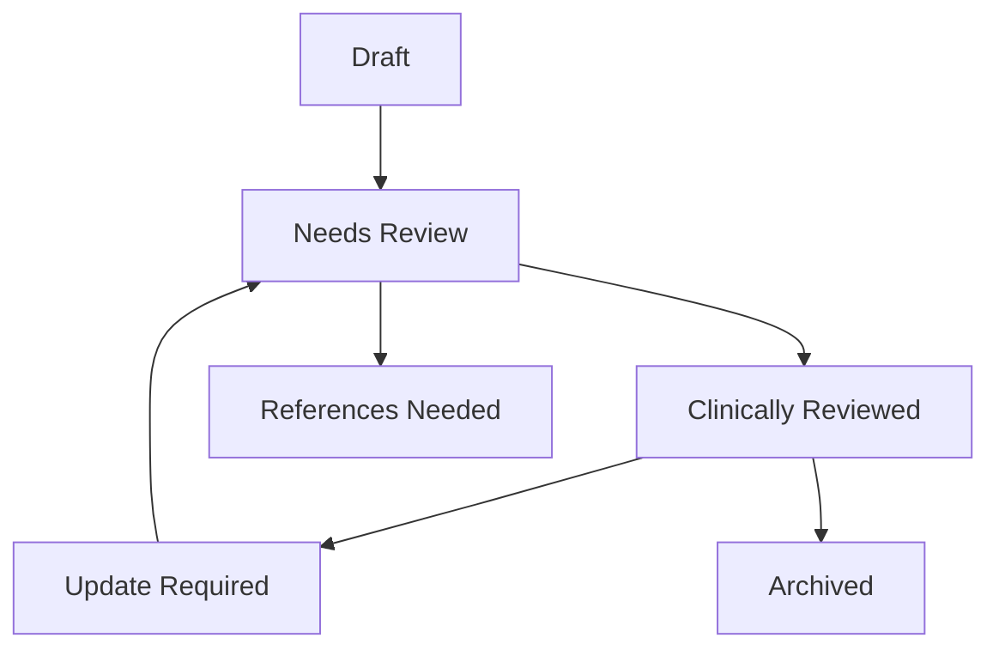

# Clinical Editorial Governance & Quality Policy

This document defines the governance structures, quality validation criteria, and operational policies for managing the Homeo Healthcare Knowledge Platform as a clinically peer-reviewed medical publication.

---

## 1. Objective of Editorial Governance

The Knowledge Platform acts as the single source of truth for homeopathic education, differential diagnostics, and materia medica. To maintain high clinical credibility, prevent safety issues, and serve as an AI-ready retrieval layer, all content must pass rigorous peer review.

---

## 2. Review Workflow & Life Cycle

Every knowledge entity (disease, symptom, remedy, lab-test, comparison) progresses through the following review statuses:

### Review Statuses:
- **`draft`**: Content is in active drafting and editing. Not visible to practitioners or patients.
- **`needs-review`**: Newly imported or modified content awaiting formal audit.
- **`clinically-reviewed`**: Verified by Dr. Jethwani or a designated clinical reviewer. Certified as safe and accurate.
- **`references-needed`**: Contains diagnostic claims lacking solid citation backing. Must be updated with reference PMIDs/DOIs.
- **`update-required`**: Stale content or articles flagged for revision due to changing consensus.
- **`archived`**: Retired profiles no longer clinically relevant.

---

## 3. Citation Health Rules

All therapeutic claims must follow strict evidence-based citation standards. We rank citation health as follows:

| Grade | Rating | Requirement | Action Required |
| :--- | :--- | :--- | :--- |
| **Excellent** | `excellent` | $\ge 3$ verified clinical citations (PMID/DOI or Materia Medica references) | No action needed. |
| **Good** | `good` | $1 - 2$ citations | Recommended to add secondary study references. |
| **Needs Attention** | `needs-attention` | $0$ citations | Blocked from AI retrieval. Add references. |
| **Critical** | `critical` | $0$ citations and includes prohibited or high-risk therapeutic claims | Urgent content revision required. |

---

## 4. Clinical Review Cadence

Content must be audited periodically to remain current:
1. **Cornerstone Articles**: Must be reviewed **every 12 months** (365-day cadence).
2. **General Remedies & Symptoms**: Reviewed **every 24 months**.
3. **Lab Tests & Normal Ranges**: Reviewed **every 12 months** or upon updates to diagnostic consensus guidelines.

---

## 5. Cornerstone Article Policy

Cornerstone articles are the first 50 flagship pages covering high-incidence conditions (e.g., GERD, Asthma, Eczema) and primary polychrests (e.g., Nux Vomica, Sulphur). 

### Validation Checklist for Cornerstones:
- A designated specialist reviewer must be explicitly assigned.
- References must be verified within the last 12 months.
- Must contain separate **Patient Summary**, **Practitioner Summary**, and **Educational Summary** blocks.
- Structured schemas must pass valid validation checks.
- Internal graph links must connect to at least 2 other related entities.

---

## 6. Reviewer Responsibilities

Clinical reviewers are responsible for:
- Verifying that homeopathically customized treatment claims align with classical literature standards (e.g. Organon, Materia Medica) and emerging clinical experience.
- Ensuring safety sections clearly highlight **red flags** and conventional contraindications.
- Checking that language is accessible, clear, and free from misleading or non-peer-reviewed claims.

---

## 7. Operational Analytics-Driven Improvement

> [!WARNING]
> **Analytics Cannot Validate Clinical Truth**
> - Telemetry and search popularity metrics must guide curation priority only.
> - Under no circumstances should engagement trends be used to validate clinical efficacy or safety of homeopathic remedies.

### SEO Findings Feed Content Updates
- Check Google Search Console CTR and positions.
- **High Impressions, Poor Ranking**: Target these pages for content enrichment, adding clinical pearls and internal links.
- **Low CTR**: Optimize titles and meta descriptions to improve user match.

### Analytics-Driven Content Priorities
- **High Traffic, Low Engagement**: Simplify long paragraphs, add comparative tables, or structure step-by-step FAQ accordions.
- **Low Traffic, High Importance**: Link these articles as inline definitions inside higher-traffic hub pages.

### Recommended Monthly Observability Review Workflow
1. **First Week of Month**: Run the Editorial Priority calculations on cornerstone content.
2. **Review Search Gaps**: Inspect redacted query buckets displaying high search counts with low matched articles to draft content expansions.
3. **Audit Citation Health**: Update any article whose citation score has fallen to warning or needs attention before publishing updates.

---

## 8. AI Retrieval Layer Separation

To prepare for next-generation LLM RAG pipelines:
- **Separation of Concerns**: AI-ready fields (semantic keywords, vectors, dense text chunks, summaries) are isolated in metadata configurations (`aiKnowledge` object).
- **RAG Ingestion**: Only articles marked `reviewStatus: "clinically-reviewed"` are indexed for semantic search retrieval.

---

## 9. Clinical OS Linking Strategy

The practitioner-facing Clinical OS utilizes the Knowledge Platform as a reference tool without duplicating content:
- **Resolution via API**: The Clinical OS queries resolvers (e.g. `getKnowledgeLinkForDisease`) to fetch dynamic URLs.
- **Sandboxed Panels**: Clinical OS renders these pages in isolated reference panels, leaving clinical decision logic independent.

---

## 10. Operations & Release Controls
For procedures on deploying changes, verifying builds, and responding to production incidents, see:
- [Production Readiness Checklist](file:///Users/drnarayanjethwani/Downloads/Website%20with%20Antigravity/docs/operations/PRODUCTION_READINESS_CHECKLIST.md)
- [Release Governance Manual](file:///Users/drnarayanjethwani/Downloads/Website%20with%20Antigravity/docs/operations/RELEASE_GOVERNANCE.md)
- [Incident Response Runbooks](file:///Users/drnarayanjethwani/Downloads/Website%20with%20Antigravity/docs/operations/INCIDENT_RUNBOOKS.md)
- [Environment Variables & Secrets Guide](file:///Users/drnarayanjethwani/Downloads/Website%20with%20Antigravity/docs/operations/ENVIRONMENT_VARIABLES.md)

