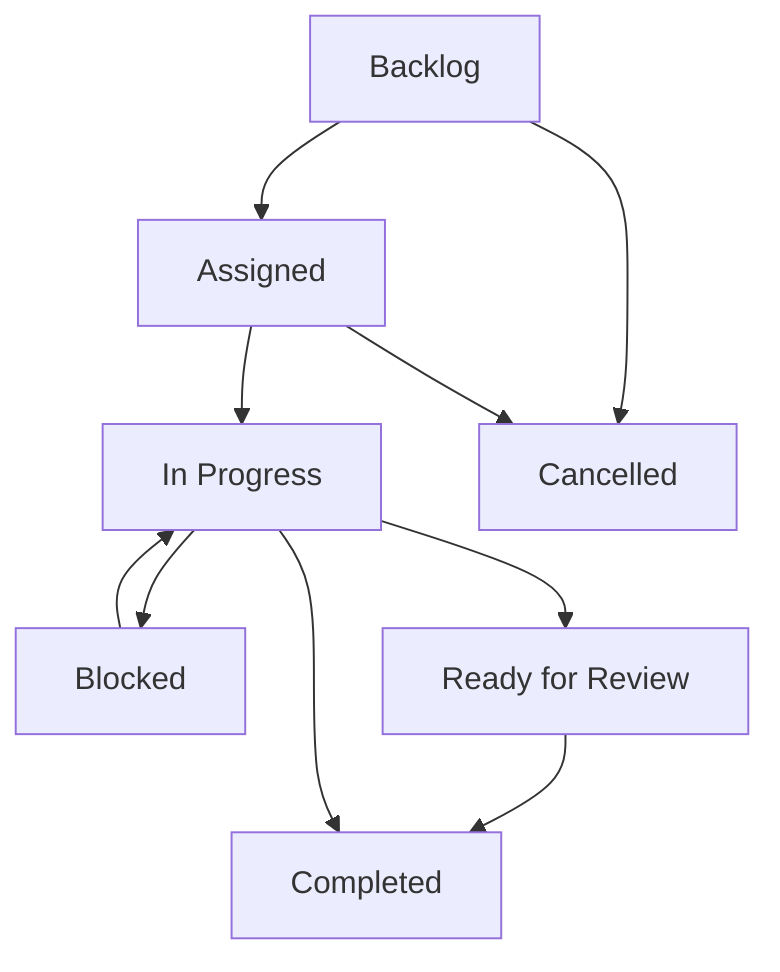

# Clinical Editorial Workflow & Curation Automation

This document outlines the operational procedures, data models, and triggers for managing the clinical publication tasks inside the Homeo Healthcare Knowledge Platform.

---

## 1. Editorial Workflow Lifecycle

Curation actions proceed through structured transitions managed exclusively inside the internal dashboard.

---

## 2. Automated Task Triggers

Curation tasks are automatically generated based on static entity conditions to enforce strict quality and timeliness limits.

| Task Type | Target Condition | Urgency / Priority | Source Trigger |
| :--- | :--- | :--- | :--- |
| **Clinical Review** (`clinical-review`) | `nextReviewDate` is past, or cornerstone article has not been reviewed in $>12$ months. | Critical / High | `review-schedule` |
| **Reference Update** (`reference-update`) | `citationHealth` score is `warning` or `Low`, or references array is empty. | Critical / Medium | `citation-health` |
| **SEO Improvement** (`seo-improvement`) | `seoStatus` is `needs-attention`, or `seoScore` $< 70\%$. | Medium | `search-console` |
| **AI Readiness** (`ai-readiness`) | `aiReadinessScore` $< 75\%$, or summary blocks are empty/uninitialized. | Low | `ai-readiness` |

---

## 3. Human Curation Invariants

To guarantee safety, the workflow engine enforces the following constraints:
- **No Automatic Approvals**: Telemetry can flag articles or recommend priorities, but **never** transitions an article to `clinically-reviewed` or `published` status automatically. An explicit clinician signature is required.
- **Audit Logging**: Any task assignment, status modification, or review completion appends a permanent log inside `knowledge_editorial_events`.
- **Isomorphism**: Curation workflow structures are strictly isolated and not loaded by public patient-facing pages.
