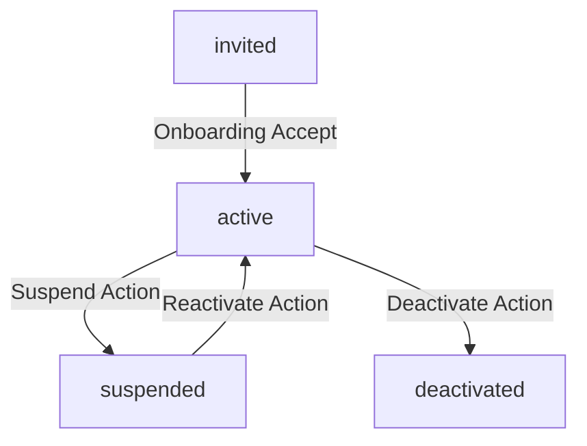

# Operations Manual: Practitioner Account Lifecycle, Invitations & Admin User Management

This operations guide explains how practitioner profiles are created, updated, suspended, deactivated, and extended within the Unified Clinical OS platform.

---

## 1. Account Status Flowchart

Practitioner accounts pass through the following states:

- **invited**: Invitation has been sent and raw token generated. An active invitation entry exists in `"practitioner_invitations"`.
- **active**: Invitation has been accepted by the practitioner, creating an active auth user mapping in `"practitioner_accounts"`.
- **suspended**: Account temporarily blocked. Administrative session validation checks fail immediately. Can be reactivated.
- **deactivated**: Account permanently disabled. Administrative session validation is rejected permanently.
- **expired**: Invitation link has passed its expiry threshold (default: 7 days) and cannot be accepted.

---

## 2. Invitation & Token Lifecycle

### A. Token Generation
1. Invitations are created using the `USER_MANAGE` permission.
2. A high-entropy 256-bit random token is generated cryptographically using Node `crypto.randomBytes(32).toString("hex")`.
3. The token is hashed with SHA-256 (`tokenHash`) and saved to the database along with the invitation role and email.
4. **Important**: The raw token is returned exactly once in the invite creation response and is NEVER stored or logged in raw form anywhere.

### B. Validation and Acceptance
1. Invitation links are sent to target emails containing the raw token.
2. During accept, the onboarding route hashes the incoming token and checks if a pending invitation matches this hash.
3. Once accepted:
   - The invitation status shifts to `"accepted"`.
   - The practitioner account is created using the role pre-assigned in the invitation. Role overrides from client payloads are completely rejected.

---

## 3. Privilege Constraints & Controls

### A. Gated Operations
- **`USER_MANAGE`**: Required to create invitations, revoke invitations, list users, edit profiles, modify roles, and trigger account suspensions or deactivations.
- **`SUBSCRIPTION_MANAGE`**: Required to modify subscription expiration dates. General user managers without this permission cannot extend clinical licensing.

### B. Safety Rules
- **No Self-Escalation**: Users cannot modify their own roles or escalate their privileges.
- **Super-Admin Confirmation**: Downgrading a super-admin requires double confirmation prompts.
- **Suspension Enforcement**: Middleware and route auth guards verify account status in real-time, blocking suspended or deactivated accounts from accessing admin endpoints.

---

## 4. Audit Log Policies
All sensitive administrative actions generate sanitized security audit logs:
- `practitioner_invited`
- `invitation_revoked`
- `invitation_accepted`
- `role_changed`
- `account_suspended`
- `account_reactivated`
- `account_deactivated`
- `subscription_extended`
- `unauthorized_user_management_attempt`

*All logs strip the raw invitation token, tokenHash, cookie values, or any clinical patient metadata.*

---

## 5. Practitioner Self-Service Settings
Practitioners can customize their visual layout workspace:
1. **Self profile details**: Editable fields are limited to display name, clinic location, and specialties.
2. **Read-only access status**: View role, active status, subscription expiry, and authorized permissions.
3. **Preferences**: Toggles for compact view densities and workspace disclaimers (note: toggles do not alter clinical scoring or bypass legal safety regulations).
4. **Security activities**: Display filtered account audit events (stripping tokens or system stack traces).

