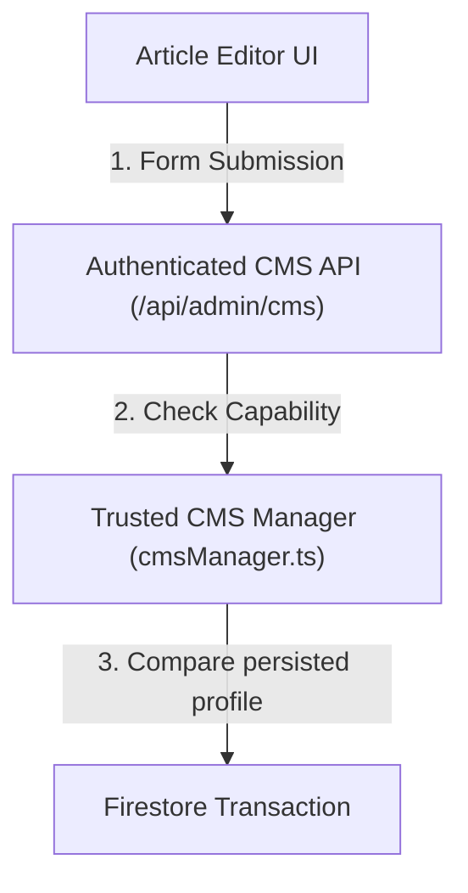

# V2.14.0-B Implementation Report

This report summarizes the codebase modifications, modules, and APIs added or extended for **V2.14.0-B — Evidence Metadata and Deterministic Retrieval Priority**.

---

## 1. Role-Capability Matrix

The following table maps the granular capabilities to governed clinical roles in the modern RBAC matrix:

| Role | `viewEvidence` | `editEvidence` | `assessClinicalEvidence` | `assessEditorialConfidence` | `configureReviewPolicy` |
|---|:---:|:---:|:---:|:---:|:---:|
| **`super-admin`** | **Yes** | **Yes** | **Yes** | **Yes** | **Yes** |
| **`editor`** | **Yes** | **Yes** | No | **Yes** | No |
| **`clinical-reviewer`**| **Yes** | **Yes** | **Yes** | No | No |
| **`operations`** | **Yes** | No | No | No | No |
| **`analytics-viewer`** | **Yes** | No | No | No | No |
| **`read-only-admin`** | **Yes** | No | No | No | No |

---

## 2. Field-Level Change Detection

In `cmsManager.ts`, saving a draft computes changes by comparing the persisted profile against the proposed profile. Changes are categorized under specific capabilities:
- **`clinicalChanged`** (requires `knowledge.assessClinicalEvidence`):
  - `evidenceStrength`
  - `sourceQuality`
  - `clinicalConfidence`
  - `classicalSource`
  - `modernSource`
- **`editorialChanged`** (requires `knowledge.assessEditorialConfidence`):
  - `editorialConfidence`
- **`policyChanged`** (requires `knowledge.configureReviewPolicy`):
  - `reviewExpiryPolicy`
  - `reviewIntervalDays`
  - `reviewGracePeriodDays`
- **`generalEdit`** (requires `knowledge.editEvidence`):
  - `rationale`

---

## 3. Strict Server-Owned Field Protection

Clients are prohibited from specifying or overwriting server-owned metadata. Any write request containing client modifications to the following fields is rejected with `400 Bad Request` at the API boundary:
- `assessedBy`
- `assessedByNameSnapshot`
- `assessedByRoleSnapshot`
- `assessedAt`
- `nextReviewDueAt`
- `citationCompleteness`
- `methodologyVersion`
- `retrievalPriority`
- `rankingExplanation`

---

## 4. Versioning and Rollback

All evidence profiles are snapshotted in `cms_versions` and are strictly immutable:
- When a version is rolled back, the historical evidence profile is copied directly into the new active draft.
- Transitioning draft status alone does not create duplicate version records.

---

## 5. UI Write Path

The clinical admin interface enforces write policies strictly via the trusted API route:

All direct client writes are forbidden inside `firestore.rules`.
