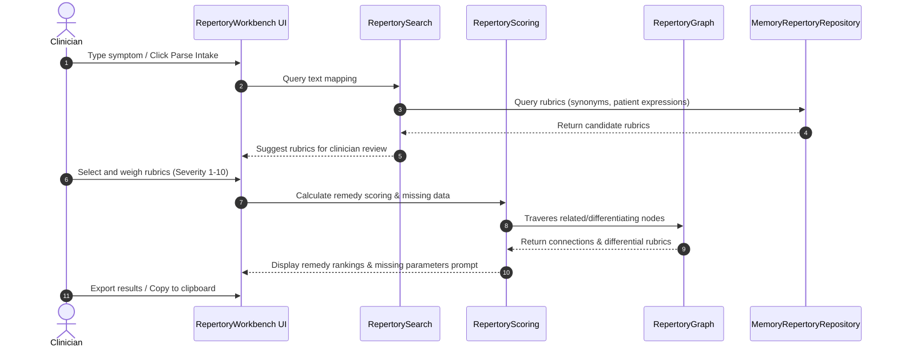

# Clinical Repertory & AI Intake Engine Module

This module upgrades the Clinical Repertory database of Dr. Jethwani's Clinical Intelligence OS™ into a structured, relationship-driven, and clinically rich repertorial knowledge engine.

---

## 📂 Directory Structure

All files relating to the upgraded repertory are isolated inside `src/features/repertory/`:

```
src/features/repertory/
├── components/
│   └── RepertoryWorkbench.tsx      # Main clinical workbench panel
├── data/
│   └── repertorySeed.ts            # High-fidelity seeded rubrics & relationships
├── database/
│   └── repertoryDb.ts              # Global repository instantiator
├── graph/
│   └── repertoryGraph.ts           # Semantic relationships and triple traversal
├── search/
│   └── repertorySearch.ts          # Synonym-expanded, NLP-weighted search matching
├── scoring/
│   └── repertoryScoring.ts         # Multi-factorial scoring and differential engines
├── types/
│   └── index.ts                    # Strong TS definitions for upgraded engine
├── validators/
│   └── databaseValidator.ts        # Database quality audit and safety verification
├── import-export/
│   └── importExportService.ts      # Import/export format adapters (JSON, CSV, RDF Turtle)
└── index.ts                        # Unified export entrypoint
```

---

## 🏛️ System Architecture & Data Flow



---

## 🏛️ Repository Pattern & Firestore Migration Path

To support a seamless and risk-free rollout, the database access layer is decoupled using the **Repository Pattern**:

*   **`RepertoryRepository` (Interface)**: Declares all query and persistence methods (`getRubrics`, `getRubricById`, `saveRubric`, etc.).
*   **`MemoryRepertoryRepository` (Implementation)**: Loads seeded rubrics into a local in-memory Map. Used in **Phase 1** for development and sandbox testing without risk of database corruption.
*   **`FirestoreRepertoryRepository` (Stub)**: Stub implementation prepared for **Phase 3** Firestore integration.

### Migration Path:
1.  **Phase 1 (Current)**: Runtime operations use the local `MemoryRepertoryRepository` initialized in `src/features/repertory/database/repertoryDb.ts`.
2.  **Phase 2**: Add offline-first caching wrapper around the repository.
3.  **Phase 3**: Implement the stubbed Firestore collection/sub-collection queries in `FirestoreRepertoryRepository.ts` and swap the instantiator inside `repertoryDb.ts`. No UI or business logic files will require modification.

---

## 🛡️ Clinical Safety Language & Claims Audit

The system enforces strict safety boundaries to prevent misrepresentation of suggestions:

*   **No Auto-Prescription**: Remedy rankings are labeled strictly as *"Repertory suggestions for clinician review"* and cannot be directly saved to a patient prescription without manual approval.
*   **Safety Badges**: Prominent banners caution: *"For clinician verification. Do not automatically prescribe."*
*   **Safety Auditor**: The `DatabaseValidator` scans titles, descriptions, and notes using regexes to block definitive claims (e.g., matching words like `cures`, `guarantees`, `confirmed diagnosis`, or `proven to heal`).

---

## 📊 Graded Remedy Scale

Remedies are mapped to rubrics with structured clinical grades:

*   **Grade 1 (Low)**: Minor symptom coverage.
*   **Grade 2 (Moderate)**: Standard symptom coverage.
*   **Grade 3 (Strong)**: Highly characteristic symptom coverage.
*   **Grade 4 (Keynote / Highest Clinical Weight)**: Keynote indicator (displayed exclusively as **"Keynote"** in the UI, avoiding absolute terms like "absolute remedy").

---

## 🧮 Multi-Factorial Scoring Formula

The scoring engine calculates candidate remedy scores by combining multiple dimensions:

$$\text{Remedy Score} = \sum_{r \in R_m} \text{Grade}(rem_r) \times \text{SymptomWeight}(r) \times \text{Confidence}(r) \times \text{ExpWeight}(rem_r) \times \text{CategoryMult}(r)$$

Where:
*   $R_m$: Set of matching rubrics covered by the remedy.
*   $\text{Grade}(rem_r)$: Grade of remedy $rem$ in rubric $r$ (1 to 4).
*   $\text{SymptomWeight}(r)$: Derived from clinician-defined severity (1-10) and frequency/impact multipliers:
    $$\text{SymptomWeight} = \text{Severity} \times \text{FreqMultiplier} \times \text{ImpactMultiplier}$$
*   $\text{CategoryMult}(r)$: Structural weight of the symptom category:
    *   *Etiology / Causation* = $2.0$
    *   *Mental & Emotional, Constitutional Generals, Thermal, Food* = $1.5$
    *   *Modalities, Sleep* = $1.2$
    *   *Local physicals* = $1.0$
    *   *Modern Clinical Conditions* = $0.8$
*   **Dominant Miasm Bonus**: $+15\%$ score boost if the remedy matches the dominant miasm of the active case.
*   **Thermal Alignment Bonus**: $+20\%$ score boost if the remedy's thermal profile aligns with the case's thermal state.
